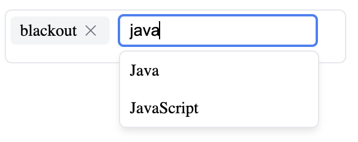

# tagger-on-it

A simple React component for selecting and managing tags with autocomplete functionality. The component supports both light and dark modes and provides a smooth user experience for tag management.



## Features

- 🏷️ Add and remove tags
- 🔍 Autocomplete suggestions
- ⌨️ Keyboard navigation support
- 🌓 Light and dark mode support
- 💾 Custom tag storage integration
- 🎨 Customizable styling

## Installation

You can either clone this repository and copy the necessary files, or copy the files directly into your project.

### Option 1: Clone the Repository

```bash
git clone https://github.com/yourusername/tagger-on-it.git
cd tagger-on-it
```

Then copy the following files into your project:
- `src/components/TagSelector/TagSelector.tsx`
- `src/components/TagSelector/types.ts`
- `src/components/TagSelector/TagSelector.module.css`
- `src/components/TagSelector/index.ts`

### Option 2: Manual File Copy

1. Copy the `TagSelector` component files from the repository into your project:
   - [TagSelector.tsx](https://github.com/yourusername/tagger-on-it/blob/main/src/components/TagSelector/TagSelector.tsx)
   - [types.ts](https://github.com/yourusername/tagger-on-it/blob/main/src/components/TagSelector/types.ts)
   - [TagSelector.module.css](https://github.com/yourusername/tagger-on-it/blob/main/src/components/TagSelector/TagSelector.module.css)
   - [index.ts](https://github.com/yourusername/tagger-on-it/blob/main/src/components/TagSelector/index.ts)

2. Install the required dependencies:

```bash
npm install @heroicons/react
npm install -D tailwindcss@latest postcss@latest autoprefixer@latest
```

3. Create a basic Next.js/React configuration file for Tailwind:
```bash
touch tailwind.config.js
```

Then add this content to `tailwind.config.js`:
```js
module.exports = {
  content: [
    "./src/**/*.{js,jsx,ts,tsx}",
    "./pages/**/*.{js,jsx,ts,tsx}",
    "./components/**/*.{js,jsx,ts,tsx}",
  ],
  theme: {
    extend: {},
  },
  plugins: [],
}
```

4. Configure PostCSS:
   If you're using Next.js, you already have a `postcss.config.mjs` file. Just make sure `tailwindcss` is included in the plugins:
   ```js
   /** @type {import('postcss-load-config').Config} */
   const config = {
     plugins: {
       tailwindcss: {},
     },
   };

   export default config;
   ```

## Quick Start

1. First, copy the `TagSelector` component files into your project
2. Install the required peer dependency
3. Create a simple implementation of the tag store
4. Use the component in your React application

Here's a minimal example:

```tsx
import { useState } from 'react';
import { TagSelector } from './components/TagSelector';
import { Tag } from './components/TagSelector/types';

// Simple in-memory tag store implementation
const simpleTagStore = {
  tags: [] as Tag[],
  
  searchTags: async (query: string) => {
    return simpleTagStore.tags.filter(tag => 
      tag.name.toLowerCase().includes(query.toLowerCase())
    );
  },
  
  createTag: async (name: string) => {
    const newTag = { id: String(Date.now()), name };
    simpleTagStore.tags.push(newTag);
    return newTag;
  },
  
  getAllTags: async () => {
    return simpleTagStore.tags;
  }
};

function App() {
  const [selectedTags, setSelectedTags] = useState<Tag[]>([]);

  return (
    <div className="p-4">
      <h1>Tag Selector Demo</h1>
      <TagSelector
        selectedTags={selectedTags}
        tagStore={simpleTagStore}
        onTagsChange={setSelectedTags}
      />
      <div className="mt-4">
        Selected tags: {selectedTags.map(tag => tag.name).join(', ')}
      </div>
    </div>
  );
}

export default App;
```

## Usage

```tsx
import { TagSelector } from './components/TagSelector';
import { TagStore } from './components/TagSelector/types';

// Implement your tag store
const myTagStore: TagStore = {
  searchTags: async (query) => {
    // Implement tag search logic
    return [];
  },
  createTag: async (name) => {
    // Implement tag creation logic
    return { id: 'new-id', name };
  },
  getAllTags: async () => {
    // Implement fetching all tags
    return [];
  },
};

function MyComponent() {
  const [selectedTags, setSelectedTags] = useState([]);

  return (
    <TagSelector
      selectedTags={selectedTags}
      tagStore={myTagStore}
      onTagsChange={setSelectedTags}
      className="custom-class"
    />
  );
}
```

## Props

| Prop | Type | Required | Description |
|------|------|----------|-------------|
| `selectedTags` | `Tag[]` | Yes | Array of currently selected tags |
| `tagStore` | `TagStore` | Yes | Interface for tag operations |
| `onTagsChange` | `(tags: Tag[]) => void` | Yes | Callback when tags change |
| `className` | `string` | No | Additional CSS classes |

## TagStore Interface

The component requires a `TagStore` implementation with the following methods:

```typescript
interface TagStore {
  searchTags: (query: string) => Promise<Tag[]>;
  createTag: (name: string) => Promise<Tag>;
  getAllTags: () => Promise<Tag[]>;
}

interface Tag {
  id: string;
  name: string;
}
```

## Features in Detail

### Tag Management
- Click the tag icon to start adding tags
- Type to search existing tags or create new ones
- Press Enter to add the typed tag
- Click the X icon to remove tags

### Autocomplete
- Shows suggestions as you type
- Displays up to 100 suggestions at a time
- Allows selecting from suggestions with mouse or keyboard
- Creates new tags if no matching tag exists

### Styling
- Responsive design
- Automatic dark mode support
- Customizable via CSS modules
- Smooth transitions and hover effects

## CSS Customization

The component uses CSS modules and CSS variables for styling. You can override the default styles by targeting the following CSS variables:

```css
.root {
  --border-color: #e5e7eb;
  --tag-bg: #f3f4f6;
  --text-primary: #000000;
  --text-secondary: #6b7280;
  --bg-primary: #ffffff;
  --input-bg: #ffffff;
  --hover-bg: #f3f4f6;
  --shadow-color: rgb(0 0 0 / 0.1);
}
```

## TagStore Examples

### Simple Local Storage Implementation
This basic implementation stores tags in the browser's localStorage:

```typescript
class LocalTagStore implements TagStore {
  private storageKey = 'tags';
  
  async searchTags(query: string): Promise<Tag[]> {
    const tags = JSON.parse(localStorage.getItem(this.storageKey) || '[]');
    return tags.filter(tag =>
      tag.name.toLowerCase().includes(query.toLowerCase())
    );
  }

  async createTag(name: string): Promise<Tag> {
    const tags = JSON.parse(localStorage.getItem(this.storageKey) || '[]');
    const newTag = { id: generateId(), name: name.trim() };
    localStorage.setItem(this.storageKey, JSON.stringify([...tags, newTag]));
    return newTag;
  }

  async getAllTags(): Promise<Tag[]> {
    return JSON.parse(localStorage.getItem(this.storageKey) || '[]');
  }
}
```


### Multi-User Implementation
For multi-user applications you may want to associate users with tags. Here's how you would do it with a database-connected store:

```typescript
class UserTagStore implements TagStore {
  constructor(private userId: string) {}
  
  async searchTags(query: string): Promise<Tag[]> {
    // Query your database for tags matching this user
    // Example: SELECT FROM tags WHERE user_id = :userId AND name LIKE :query
    return tags;
  }
  async createTag(name: string): Promise<Tag> {
    // Insert tag with user association
    // Example: INSERT INTO tags (id, name, user_id) VALUES (:id, :name, :userId)
    return newTag;
  }
  async getAllTags(): Promise<Tag[]> {
    // Get all tags for this user
    // Example: SELECT FROM tags WHERE user_id = :userId
    return tags;
  }
}

// Usage:
const userTagStore = new UserTagStor(currentUserId);
<TagSelector store={userTagStore} />
```

## License
MIT

## Dependencies Licenses

This component uses the following open source dependencies:

### Production Dependencies

- **@heroicons/react** (v2.2.0) - [MIT License](https://github.com/tailwindlabs/heroicons/blob/master/LICENSE)


### Development Dependencies

- **@types/node** (v20.11.0) - [MIT License](https://github.com/DefinitelyTyped/DefinitelyTyped/blob/master/LICENSE)
- **@types/react** (v18.2.0) - [MIT License](https://github.com/DefinitelyTyped/DefinitelyTyped/blob/master/LICENSE)
- **@types/react-dom** (v18.2.0) - [MIT License](https://github.com/DefinitelyTyped/DefinitelyTyped/blob/master/LICENSE)
- **@types/uuid** (v9.0.7) - [MIT License](https://github.com/DefinitelyTyped/DefinitelyTyped/blob/master/LICENSE)
- **autoprefixer** (v10.4.20) - [MIT License](https://github.com/postcss/autoprefixer/blob/main/LICENSE)
- **postcss** (v8.5.1) - [MIT License](https://github.com/postcss/postcss/blob/main/LICENSE)
- **tailwindcss** (v4.0.3) - [MIT License](https://github.com/tailwindlabs/tailwindcss/blob/master/LICENSE)
- **typescript** (v5.3.0) - [Apache License 2.0](https://github.com/microsoft/TypeScript/blob/main/LICENSE.txt)

## Examples

Check out the `examples` folder for complete, runnable implementations:

- `SimpleExample.tsx` - Basic in-memory implementation
- `LocalStorageExample.tsx` - Persistent storage using localStorage
- `AsyncExample.tsx` - Async implementation with loading states

### Running the Examples

To run the examples, you'll need to:

1. Make sure you have installed all dependencies (see Installation section above)

2. Add Tailwind CSS to your project:
```bash
npx tailwindcss init -p
```

3. Import the examples into your app:
```tsx
import SimpleExample from './examples/SimpleExample';
import LocalStorageExample from './examples/LocalStorageExample';
import AsyncExample from './examples/AsyncExample';

function App() {
  return (
    <div>
      <SimpleExample />
      <LocalStorageExample />
      <AsyncExample />
    </div>
  );
}
```

Each example demonstrates different usage patterns and implementation strategies.

---

