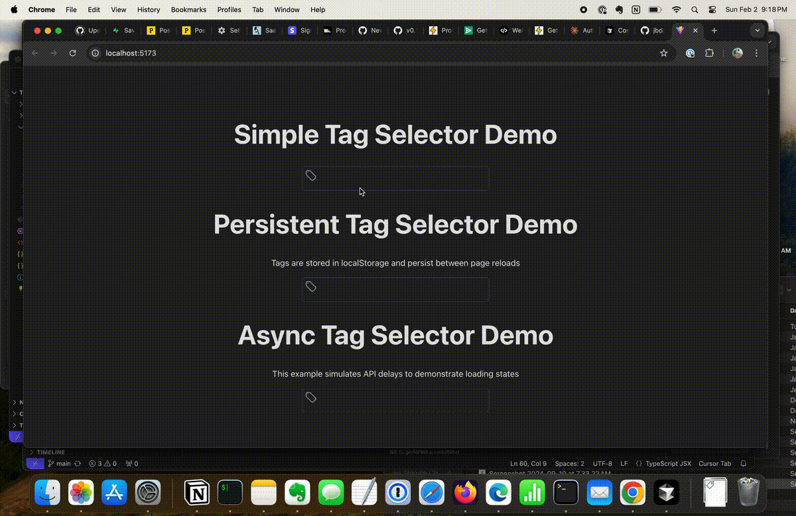

# tagger-on-it

A simple React component for selecting and managing tags with autocomplete functionality. The component supports both light and dark modes and provides a smooth user experience for tag management.

<!--  -->
 

## Features

- 🏷️ Add and remove tags
- 🔍 Autocomplete suggestions
- ⌨️ Keyboard navigation support
- 🌓 Light and dark mode support
- 💾 Custom tag storage integration
- 🎨 Customizable styling


## Installation

 

1. You can quickly test this component by creating a new Vite project:
```
npm create vite@latest tagger-test -- --template react
```

2. Copy the TagSelector directory to src/components
```
src/
  components/
    TagSelector/
      TagSelector.tsx
      types.ts
      TagSelector.module.css
      icons/
        index.ts
      index.ts
```

3. Copy the examples directory to src/examples

Each example demonstrates different usage patterns and implementation strategies for the TagSelector component. Review the example code to understand different ways to integrate the component with various storage mechanisms.
```
src/
  examples/
    SimpleExample.tsx
    LocalStorageExample.tsx
    AsyncExample.tsx
```

4. Replace the App.tsx file created by the Vite project with the following:
```tsx
import { useState } from 'react'
import './App.css'
import SimpleExample from './examples/SimpleExample'
import LocalStorageExample from './examples/LocalStorageExample'
import AsyncExample from './examples/AsyncExample'
export default function App() {
  return (
    <>
    <div align="center">
      <div>
        <SimpleExample />
      </div>
      <div>
        <LocalStorageExample />
      </div>
      <div>
        <AsyncExample />
      </div>
    </div>
    </>
  )
}
```


## Features in Detail

### Tag Management
- Click the tag icon to start adding tags
- Type to search existing tags or create new ones
- Press Enter to add the typed tag
- Click the X icon to remove tags

### Autocomplete
- Shows suggestions as you type
- Displays up to 100 suggestions at a time
- Allows selecting from suggestions with mouse or keyboard
- Creates new tags if no matching tag exists

### Styling
- Responsive design
- Automatic dark mode support
- Customizable via CSS modules
- Smooth transitions and hover effects


---
## License
MIT

---
## attributions

- [Heroicons](https://heroicons.com/) for the icons